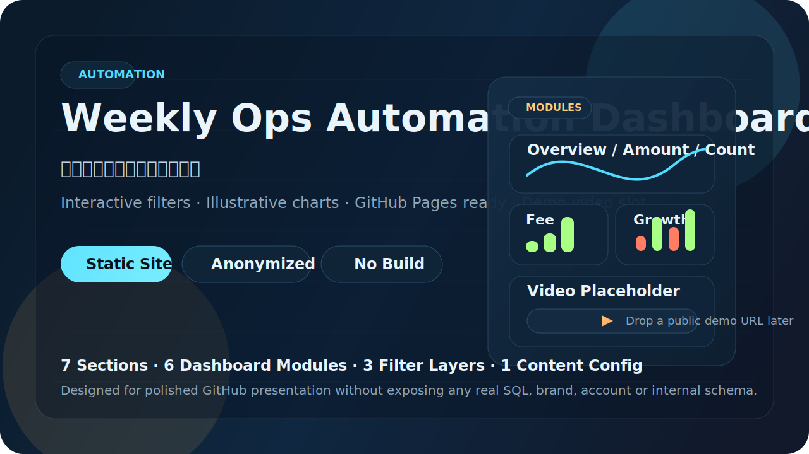
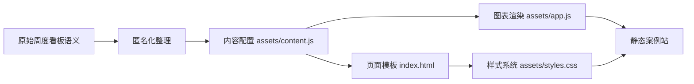

<p align="center">
  
</p>

<h1 align="center">Weekly Ops Automation Dashboard</h1>

<p align="center"><strong>一个匿名化的周度运营分析案例站</strong></p>

<p align="center">
  将一份内部风格的周度运营仪表盘，整理成适合公开展示的 GitHub Pages 项目：<br>
  保留自动化周报看板的结构与交互逻辑，移除真实品牌、字段、账号、SQL 与业务识别信息。
</p>

<p align="center">
  
  
  
  
</p>

---

## 项目概览

这个仓库不是在公开原始业务系统，而是在公开一种更适合放到 GitHub 上的表达方式：

- 把原始周度看板的思路，重组为单页案例站
- 用三层筛选保留真实阅读路径
- 用示意化图表表达指标关系，而不是暴露真实数据
- 在页面首屏和底部都预留视频演示位，方便后续补演示链接
- 采用零构建静态站结构，上传后即可部署到 GitHub Pages

## 为什么它适合公开展示

| 维度 | 公开版做法 | 带来的结果 |
| --- | --- | --- |
| 信息安全 | 去掉真实品牌、内部命名、账号、SQL、表结构 | 不会把内部实现直接暴露到公开仓库 |
| 项目表达 | 重写为案例站叙事，而不是只放原始导出文件 | GitHub 首页观感更完整 |
| 图表呈现 | 用本地脚本生成脱敏示意图 | 保留分析能力展示，不依赖真实数据源 |
| 维护方式 | 所有文案和数据集中在 `assets/content.js` | 后续换内容、换视频、换图表都更轻松 |

## 页面包含哪些部分

页面固定为 7 个区块：

| 区块 | 作用 | 说明 |
| --- | --- | --- |
| 首屏介绍 | 先讲项目定位 | 说明这是一个匿名化的周度自动化看板案例 |
| 项目背景 | 讲清来源与改造策略 | 解释为什么要从内部风格看板转成公开案例页 |
| 核心能力 | 提炼项目亮点 | 强调筛选、节奏、结构、可扩展性 |
| 六个看板模块 | 展示主要分析模块 | 保留总览、规模、笔数、手续费、变化率、活跃主体 |
| 数据流与系统结构 | 讲清流程 | 展示采集、整理、度量、看板、复盘链路 |
| 成果与价值 | 总结站点层面的价值 | 强调可部署、可演示、可配置 |
| 视频演示位 | 留给后续演示 | 默认占位，后续补地址即可切换 |

## 六个看板模块

| 模块 | 展示重点 | 公开版表达方式 |
| --- | --- | --- |
| 总体概览 | 当前切片下的重点信号 | 焦点指标卡 + 趋势小图 |
| 交易规模 | 周度规模走势 | 折线 + 对照线 |
| 交易笔数 | 数量与节奏变化 | 柱状趋势图 |
| 手续费 | 收益指标的稳定性 | 折线 + 费效信息 |
| 环比变化 | 异常周和变化率 | 正负条形图 |
| 活跃主体 | 覆盖范围与参与深度 | 活跃度趋势线 |

## 交互设计

页面保留了原始看板里最重要的三层筛选关系：

| 筛选层 | 作用 |
| --- | --- |
| 业务维度 | 用不同业务切片看同一组指标 |
| 场景维度 | 让线下、线上、会员等观察面可以切换 |
| 指标焦点 | 在交易规模、交易笔数、手续费、环比变化、活跃主体之间切换 |

筛选变化后，以下内容都会联动：

- 首屏摘要文案
- 指标焦点卡
- 六个看板模块中的示意图
- 成果区的当前切片摘要
- 视频位之外的动态说明信息

## 页面结构示意


## 数据流与内容组织



## 项目结构

```text
.
├─ index.html
├─ README.md
└─ assets
   ├─ app.js
   ├─ content.js
   ├─ readme-hero.svg
   └─ styles.css
```

## 关键文件说明

| 文件 | 作用 |
| --- | --- |
| `index.html` | 页面骨架与所有区块容器 |
| `assets/styles.css` | 视觉风格、布局、响应式样式 |
| `assets/content.js` | 页面文案、标签、模块说明、流程节点、示意数据、视频地址 |
| `assets/app.js` | 筛选联动、数据组合、SVG 图表渲染、视频占位切换 |
| `assets/readme-hero.svg` | 仓库首页横幅图 |

## 如何本地预览

### 方式一：直接打开

直接双击 `index.html` 即可查看页面。

### 方式二：本地静态服务

```powershell
python -m http.server 4173
```

然后访问：

```text
http://127.0.0.1:4173/
```

## 上传到 GitHub 的推荐方式

1. 在 GitHub 新建仓库，例如：`weekly-ops-automation-dashboard`
2. 把当前目录下的项目文件上传到仓库根目录
3. 不需要上传本地的 `.git` 文件夹
4. 在仓库 `Settings -> Pages` 中开启 GitHub Pages
5. 选择默认分支根目录作为部署来源

## 如何替换视频演示位

在 `assets/content.js` 中找到这段配置：

```js
meta: {
  demoVideo: {
    url: null,
    caption: "将这个字段替换为公开视频地址后，页面会自动切换为可播放或可跳转的演示状态。"
  }
}
```

把 `url` 改成公开视频地址即可：

```js
demoVideo: {
  url: "https://your-public-demo-url",
  caption: "可选说明文案"
}
```

当前页面支持三种演示状态：

- `null`：显示占位卡
- 视频文件地址：显示 `<video>` 播放器
- 可识别的公开视频地址：自动切换为嵌入或跳转入口

## 如何改内容而不改代码结构

大多数内容都集中在 `assets/content.js`：

- `meta`：站点标题、描述、仓库名、视频演示位
- `hero`：首屏标题、副标题、标签
- `background`：项目背景说明
- `capabilities`：核心能力卡片
- `modules`：六个模块的标题与描述
- `systemFlow`：流程结构卡片
- `outcomes`：成果与价值区块
- `filters`：三层筛选项
- `model`：示意图数据模型

也就是说，如果你只是想改：

- 文案
- 标签
- 指标名
- 模块名
- 演示视频
- 图表走势

通常都不需要去改 `index.html` 的结构。

## 匿名化原则

这个仓库默认遵循以下公开展示原则：

- 不提交原始导出文件
- 不公开真实品牌名与组织信息
- 不公开内部账号、邮件地址、凭证信息
- 不公开真实 SQL、库表名、字段名和数据源配置
- 不使用真实经营数据作为页面图表内容

## 适合继续补充的内容

如果你后面还想把仓库做得更完整，建议优先补这几类内容：

- 一段真实的操作录屏或演示视频
- 一张页面成品截图
- 一段更具体的“从原始仪表盘到公开版案例”的对比说明
- 一个英文版 README 摘要，方便外部阅读者快速理解

## 项目定位

这是一个更偏“自动化周报看板案例展示”的仓库，不是原始系统备份，也不是数据源导出仓库。

它的核心价值在于：

- 表达自动化运营分析能力
- 展示信息架构和交互设计能力
- 在公开环境中保持内容安全
- 让页面可以直接作为 GitHub 首页项目展示
